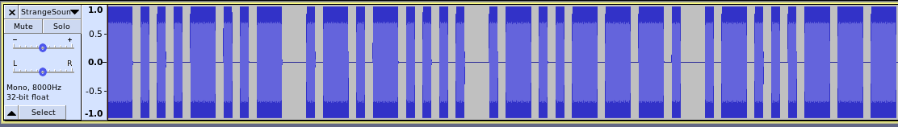

## Strange Sounds
The challenge was this long song with long and short beeps

## Solving
Using [pysoundfile](https://pysoundfile.readthedocs.io/en/0.8.1/) I wrote the first script `strange_sound.py`, which transforms the .vaw in an array of values. These values are then analysed and transformed in 1 or 0. Using it, I created the `strange.dat` file (`python3 strange_sound.py > strange.dat`).

The second script `strange2.py` is then used. It opens the previously created file `strange.dat`, and writes it in a file as binary data.
The output file was firstly created without extension, and using exiftools on the file showed us it was a png file.